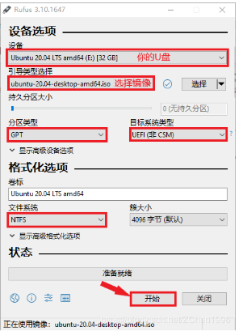

#### Ubuntu-18.04-LTS安装指南

`https://blog.csdn.net/liuxiaodong400/article/details/80946225`

* 下载Ubuntu-18.04-LTS.iso文件
* 使用的工具是Rufus制作启动U盘
* 格式化电脑硬盘，为Ubuntu系统安装留出空间，点击管理，进入计算机管理



#### 设置BIOS

插上U盘

安装双系统时，进入【控制面板】-【电源选项】-【选择电源按纽功能】，我们可以看到【关机设置】下的**启用快速启动**消失；

关机，开机按F2，进入BIOS，左右键切换到security，把下面的secure boot改成disable
再切换到BOOT选项，将BOOT MODE改成UEFI。
然后F10保存关闭

#### 联想电脑开机进入BIOS

F2 -> select input device ; F10 -> dignosis; F12 -> entry setup Bios

#### 安装ubuntu

开机，按F10，选择你的U盘（不是windows boot manager哦）应该是generic flash disk。回车，进入如下界面：先别急着按回车
选择第一个ubuntu然后按e进入编辑模式，将**倒数第二行的—**改成 nomodeset 。如果这里不修改，过会安装会卡住，只能强制关机重来。修改好了按F10。
然后进入安装界面，选择语言中文简体，然后按下一步，选择完全安装，还有下面的“为图形或者无线硬件，以及mp3…”也选中，然后下一步，这里会卡一下好像，
到安装类型界面，就是有三个选项，其中第一个是windows boot manager什么的，这里选择第三个 其他选项，继续，然后是磁盘分配。

#### 开机启动u盘的时候出现/casper/vmlinuz.efi: file not found

解决2：把iso镜像文件copy到新的分区，重点是接下来的。解压一份iso文件，找到里面的vmlinuz文件和initrd.lz文件，不同版本存位置可能不同，找到后copy到分区根目录。。

#### 磁盘分配

1. swap----128G（当前64G内存），主分区，其他逻辑分区

交换空间，类似Windows下的虚拟内存。空间大小，一般是等于电脑内存；如果容量足够，可以等于物理内存的2倍。比如我的是16GB内存，就可以给固态硬盘32GB的空间，太小也不好，太大也没用。32GB=32768MB。

2. efi ----1G

它的作用和boot引导分区一样，但是boot引导默认grub引导，而efi是UEFI引导。不要按照那些老教程去选boot引导分区，否则就无法使用UEFI启动系统。

3. /----剩余固态

“/”就是把除挂载home之外的全部杂项囊括了，空间也不要太小，分配固态硬盘剩余部分。

4. /home----机械全部

相当于个人文件夹，用户存储数据，类似Windows下的User。建议分配稍微大点，因为以后自己的图片、视频、下载内容基本都在这里面

#### 安装ubuntu出现黑屏

原因分析：由于ubuntu对于显卡支持有问题，需要手动添加显卡驱动选项

解决办法：
一、安装时，选择"install ubuntu"后，按"e"进入编辑模式，进入命令行模式, 然后去掉"--"后，依照不同显卡进行不同显卡驱动选项的添加。

1.Intel 82852/82855 或8系列显示晶片：i915.modeset=1或i915.modeset=0
2.Nvidia：nomodeset
3.其它厂牌(如ATI，技嘉)：xforcevesa或radeon.modeset=0 xforcevesa
[DELL T3400显卡为Nvidia FX580，选择nomodeset]

进入安装时，光标移动到"install ubuntu"，按"e"进入编辑模式，进入命令行模式,找到''quite splash''然后去掉"--"后，添加“nomodeset”（依照不同显卡进行不同显卡驱动选项的添加，我们使用的是Nvidia显卡，添加nomodeset）F10安装

#### 开机后黑屏

当ubuntu安装结束后，启动系统出现黑画面。

1.开机，进入grub画面(如果硬碟没有别的OS,请开机时按住shift不放才会有grub画面)

2.按'''e''' 进入编辑开机指令的模式, 同样找到'''quite splash''' 并在后面加上对应的字。

3.按 ''F10''启动系统.

4.进去系统之后编辑'''/etc/default/grub''' 这个档案(要管理者权限sudo)。
Ubuntu>打开终端机，输入sudo vi /etc/default/grub

5.找到这一行:
GRUB_CMDLINE_LINUX_DEFAULT="quiet splash"
修改为：
GRUB_CMDLINE_LINUX_DEFAULT="quiet splash nomodeset"

\6. 更新GRUB： sudo update-grub

7.存档，并重新开机。


#### 查看GPU相关信息

```
# 查看硬件安装情况
lspci

# 查看驱动是否安装
glxinfo |head
```

#### 安装nvidia驱动

2.1 卸掉已安装的驱动

```
sudo apt-get purge nvidia*
```

 卸载驱动sudo apt-get purge nvidia*，这个可以卸载，但有时候也会卸载不了，如果执行这句话之后再输入nvidia-smi，仍然有Nvidia的驱动信息，则说明没有卸载成功，此时用这句话

```
sh ./nvidia.run --uninstall 
```

当然runfile安装的时候会卸载掉之前的驱动，所以可以不用手动去卸载。　

2.2  禁用 nouveau

参考：http://www.cnblogs.com/Qwells/p/6086773.html#undefined

新建blacklist-nouveau.conf文件，输入命令：

```
sudo gedit /etc/modprobe.d/blacklist-nouveau.conf
```

往文中写入参数：

```
blacklist nouveau
blacklist lbm-nouveau
options nouveau modeset=0
alias nouveau off
alias lbm-nouveau off
```

　　保存并退出。这一步是为了禁掉Ubuntu自带开源驱动nouveau。之后sudo reboot重启系统。在终端执行命令：

```
lsmod | grep nouveau
```

　　查看nouveau模块是否被加载。如果什么都没输出，则执行下一步。 

```
#如果nouveau禁用不了，输入下面命令，并reboot
sudo update-initramfs -u
```

2.3  给驱动run文件赋予执行权限

```
sudo chmod a+x NVIDIA-Linux-x86_64-375.66.run
```

2.4 安装 驱动

```
sudo bash ./NVIDIA-Linux-x86_64-375.20.run -no-x-check -no-nouveau-check -no-opengl-files
```

　　必须加上 --no-opengl-files ,否则会出现题主要是三种，（1）循环登录，也就是登录之后在退出来到登录界面; （2）界面变得很大，看着心慌，哈哈;   （3）登录进去了，显示正常了，结果只有桌面背景和鼠标等等

安装过程中，出现缺少“gcc”，“make”，可通过命令直接安装

```
sudo apt install gcc
sudo apt install make
```

提示yes or no，选NO,有三个选择no

2.5 完成后重启，使用nvidia-smi验证是否安装成功


#### 安装cuda+cudnn

##### 1. 下载cuda，推荐使用runfile安装

`https://developer.nvidia.com/CUDA-TOOLKIT-ARCHIVE`

运行run文件

```
# 1 安装CUDA 10
sudo chmod +x cuda_10.0.130_410.48_linux.run     # 给安装文件赋予执行权限
sudo ./cuda_10.0.130_410.48_linux.run            # 运行执行文件
Do you accept the previously read EULA?
accept/decline/quit: accept

# 问是否安装nvidia显卡驱动（cuda10自带），前面我们已经安装，此处不再安装，
# 如果选择yes，麻烦就大了，cuda10自带的显卡驱动会覆盖前面已经安装的显卡驱动，
# 而cuda10自带的显卡驱动版本号是410，然而1660Ti的显卡驱动最低要求版本为418，
# 如果安装了cuda10自带驱动，最终结果就是连系统桌面都打不开
Install NVIDIA Accelerated Graphics Driver for Linux-x86_64 410.48?
(y)es/(n)o/(q)uit:n

# 是否安装cuda工具包
Install the CUDA 10.0 Toolkit?
(y)es/(n)o/(q)uit:y

Enter Toolkit Location
[ default is /usr/local/cuda-10.0 ]: 按回车键

Do you want to install a symbolic link at /usr/local/cuda?
(y)es/(n)o/(q)uit: y 

# CUDA示例程序，是否安装看个人，我选择不安装
Install the CUDA 10.0 Samples?
(y)es/(n)o/(q)uit: n

# 安装完成后如下图所示，显示未完全安装，没有安装显卡驱动，这是我们选择安装显卡驱动时选择了no

# 2 配置CUDA 10环境变量
sudo gedit ~/.bashrc
# 在文件结尾添加以下两行
export LD_LIBRARY_PATH=/usr/local/cuda-10.0/lib64:$LD_LIBRARY_PATH
export PATH=/usr/local/cuda-10.0/bin:$PATH
# 刷新.bashrc文件
source ~/.bashrc

# 3 测试CUDA 10是否安装成功
# 查看CUDA 10版本号（如下图输出）
nvcc -V
# 测试样本案例（如下图输出 Result = PASS 表示安装成功）
cd /usr/local/cuda-10.0/samples/1_Utilities/deviceQuery
sudo make
./deviceQuery
```

 查看cuda版本:

```
cat /usr/local/cuda/version.txt
```

##### 2. 安装cudnn

cuDNN 的安装，就是将 cuDNN 包内的文件，拷贝到cuda文件夹中即可。

下载的cuDNN 版本为`https://developer.nvidia.com/zh-cn/cudnn`

先解压，然后将其中的内容复制到CUDA安装文件夹里面.

`tar zxvf 文件名.tgz -C ./`

```
sudo cp cuda/include/cudnn.h /usr/local/cuda/include
# 注意，解压后的文件夹名称为cuda ,将对应文件复制到 /usr/local中的cuda内
sudo cp cuda/lib64/libcudnn* /usr/local/cuda/lib64
sudo chmod a+r /usr/local/cuda/include/cudnn.h /usr/local/cuda/lib64/libcudnn*
```

在终端查看CUDNN版本：

```
cat /usr/local/cuda/include/cudnn.h | grep CUDNN_MAJOR -A 2
```

#### 装机必做

##### 1. 18.04配置镜像源

首先拷贝一份`/etc/apt/sources.list`文件

`sudo cp -v /etc/apt/sources.list /etc/apt/sources.list.backup`

然后编辑`sources.list`文件

`sudo gedit /etc/apt/sources.list`

然后全选并删除里面的内容，添加清华镜像源。

```
# 默认注释了源码镜像以提高 apt update 速度，如有需要可自行取消注释 deb https://mirrors.tuna.tsinghua.edu.cn/ubuntu/ bionic main restricted universe multiverse # deb-src https://mirrors.tuna.tsinghua.edu.cn/ubuntu/ bionic main restricted universe multiverse deb https://mirrors.tuna.tsinghua.edu.cn/ubuntu/ bionic-updates main restricted universe multiverse # deb-src https://mirrors.tuna.tsinghua.edu.cn/ubuntu/ bionic-updates main restricted universe multiverse deb https://mirrors.tuna.tsinghua.edu.cn/ubuntu/ bionic-backports main restricted universe multiverse # deb-src https://mirrors.tuna.tsinghua.edu.cn/ubuntu/ bionic-backports main restricted universe multiverse deb https://mirrors.tuna.tsinghua.edu.cn/ubuntu/ bionic-security main restricted universe multiverse # deb-src https://mirrors.tuna.tsinghua.edu.cn/ubuntu/ bionic-security main restricted universe multiverse # 预发布软件源，不建议启用 # deb https://mirrors.tuna.tsinghua.edu.cn/ubuntu/ bionic-proposed main restricted universe multiverse # deb-src https://mirrors.tuna.tsinghua.edu.cn/ubuntu/ bionic-proposed main restricted universe multiverse
```

配置好后，更新源

`sudo apt-get update`