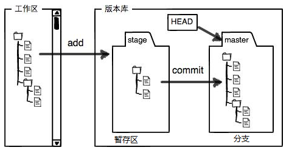
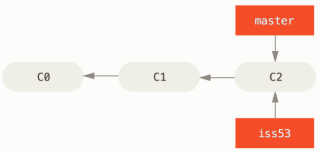
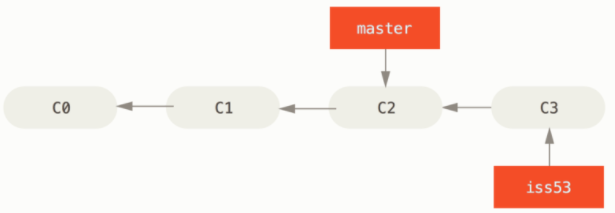
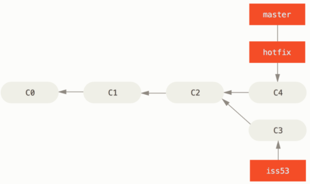
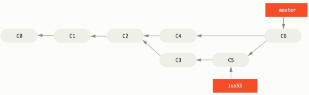

# git远程管理



```
# 查看历史记录，找到对应的commit的ID
git log
git log --pretty=oneline

# 回到上一个commit版本
git reset --hard HEAD^

# 回到指定的版本，包括未来版本
git reset --hard 1094a

# 查看当前状态
git status

# 查看工作区和版本库里面最新版本的区别
git diff HEAD -- readme.txt

# 把暂存区的add修改撤销掉（unstage），重新最近commit状态
git reset HEAD readme.txt

# 把工作区的修改全部撤销
git checkout -- readme.txt

#删除文件和版本库内的文件
rm test.txt
git rm test.txt
git commit -m "remove test.txt"

###########################################################
# ----------------远程仓库 ----------------------------------------------------------------

# 没有.ssh目录，需要创建
ssh-keygen -t rsa -C "youremail@example.com"

# 将id_rsa.pub文件的内容粘贴至github SSH Keys中。

# 本地仓库与远程仓库关联
git remote add origin git@github.com:michaelliao/learngit.git

# 第一次把本地库的所有内容推送到远程库
git push -u origin master

# 以后提交远程仓库时
git push origin master

# 删除远程
git remote rm origin

###########################################################
# ----------------开设分支 ----------------------------------------------------------------

# 在当前开设分支，并解决部分问题
git checkout -b iss53  
# 等价于如下两条命令
git branch iss53
git checkout iss53

```



```
# 在分支iss53上进行如下修改
vim index.html
git commit -a -m 'added a new footer [issue 53]'
```



```
# 解决另一个问题，创建分支hotfix
git checkout -b hotfix
vim index.html
git commit -a -m 'fixed the broken email address'

# 切换到master分支
git checkout master

# 融合分支
git merge hotfix
```



```
# 在iss53上继续工作
$ git checkout iss53
$ vim index.html
$ git commit -a -m 'finished the new footer [issue 53]'

# 合并iss53的修改
$ git checkout master
Switched to branch 'master'
$ git merge iss53
```



```
#分支合并后不再需要，删除
git branch -d iss53

# 查看所有分支
git branch -a
# 查看当前分支
git branch
# 切换分支
git checkout 分支名
```

