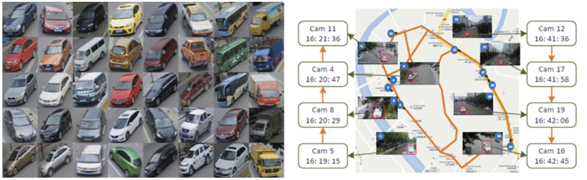

# 常用数据集

### 一、智慧交通

1）ai city challenge [webset](www.aicitychallenge.org)

**下载链接**

轨道1：城市规模的多摄像机车辆跟踪（大小：16.2 GB）

[Track1-下载](http://www.aicitychallenge.org/track1-download/)

专题2：城市规模的多摄像机车辆重新识别（大小：1.7 GB）

[Track2-下载](http://www.aicitychallenge.org/track2-download/)

专题3：流量异常检测（大小：11.5 GB）

[Track3-下载](http://www.aicitychallenge.org/track3-download/)

2020 AI City挑战

- DOT用于信号时序规划的转数
- 城市规模的多摄像机车辆重新识别w。真实和综合训练数据
- 城市规模的多摄像机车辆跟踪
- 异常检测–检测异常情况，例如车道违规，错误方向驾驶等。

### 二、智能驾驶

#### 1）车辆、行人检测

##### 1. 滴滴数据集（没有交通标志）

1. https://outreach.didichuxing.com/d2city/challenge
   2.D2City
   是一个大规模行车视频数据集，提供了超过一万段行车记录仪记录的前视视频数据。https://outreach.didichuxing.com/d2city/d2city
2. 滴滴数据集说明：
   2.1. 检测目标没有交通标志、类别是各种各样的车辆和人；

##### 2. UA-DETRAC车辆检测数据集 [官网](http://detrac-db.rit.albany.edu/)

该数据集包含10小时的捕获视频以25帧每秒(fps)的速度录制，分辨率为960*540像素。在UA-DETRAC数据集中有超过14万帧，8250辆车被手工标注，导致总共121万标记的对象边框。

##### 国内下载

链接：https://pan.baidu.com/s/1lTv-oMXFvuID8ByDPz8SvQ
密码：v1os

##### 数据集数据格式-及测评工具包

链接：https://blog.csdn.net/firing00/article/details/100847948

##### 3. GTI 数据集 [官网](https://www.gti.ssr.upm.es/data/Vehicle_database.html)

64×64的小图，4000张车屁股图片，4000张普通道路图片，数据库根据姿态将图像划分为四种:镜头前的中间/近距离、左边的中间/近距离、右边的近/中距离、远距离。使用了部分 [Caltech Database](http://www.vision.caltech.edu/html-files/archive.html)和[TU Graz-02 Database](http://www.emt.tugraz.at/~pinz/data/GRAZ_02/)数据集里的图片，凑齐4000张。

##### 4. Cars Dataset [官网](https://ai.stanford.edu/~jkrause/cars/car_dataset.html)

Cars数据集包含196个car类的16,185张图像。数据被分割成8,144张训练图像和8,041张测试图像，每个类被大致分割成50-50的比例。等级通常按*Make, Model, Year*, e.g. 2012 Tesla Model S or 2012 BMW M3 coupe.。

##### 5. *UIUC* car database [官网](https://cogcomp.seas.upenn.edu/Data/Car/)

这个由Shivani Agarwal, Aatif Awan和Dan Roth制作的UIUC汽车数据集包含用于评估目标检测算法的汽车侧面图像。数据集包含1050张训练图像(550张car和500张非car图像)，存在两种测试设置。首先，有170张单尺度测试图像，包含200辆汽车，其规模与训练图像大致相同。其次，有108幅多尺度测试图像，包含不同尺度下的139辆汽车。这些图像都是灰色的，并且是以raw PGM格式提供的。

##### 6. VeRi dataset [主页](https://github.com/JDAI-CV/VeRidataset)

为了便于车辆重识别(Re-Id)的研究，我们在真实的城市监控场景中建立了一个大规模的车辆重识别banchmark dataset数据集，命名为“VeRi”。

- 包含了超过50000张776辆汽车的照片，这些照片是由20个摄像头在24小时内拍摄的，覆盖范围为1.0平方公里的区域
- 在真实世界中不受约束的监视场景中捕获的，并标有各种属性，例如bbox、类型、颜色和品牌
- 每辆车都被2 ~ 18个摄像头在不同的视点、光照、分辨率和遮挡下拍摄
- 贴上了足够的车牌和时空信息，如车牌箱、车牌串、车辆的时间戳、相邻摄像头之间的距离等。

**Recently, we release a large-scale Multi-grained Vehiclde Parsing dataset in the wild. Please refer to [MVP](https://lxc86739795.github.io/MVP.html) to download it!**

这个数据集适用于车辆图片的语义分割，包括粗略标签和精细标签。里面的部分图片是来自veri，和[AICITY19-ReID](https://www.aicitychallenge.org/) , and [VeRi-Wild](https://github.com/PKU-IMRE/VERI-Wild) 

#### 2）交通标志、信号灯检测

2019-11-28【网上开源的数据集】交通 数据集：【数据集-交通标志 红绿灯】红绿灯 交通标志

https://blog.csdn.net/weixin_42419002/article/details/100605115

##### 1. Chinese Traffic Sign Database (自动化的) CTSDB

1. 官网链接：http://www.nlpr.ia.ac.cn/pal/trafficdata/recognition.html

#### 3）追踪

##### 1. 多目标追踪资源列表（数据集、论文、代码和牛人主页等） 

https://www.sohu.com/a/293967358_650579

#### 4）轨迹

1. 车辆行驶数据

https://www.cnblogs.com/genghenggao/p/9625440.html

### 三、其他AI

